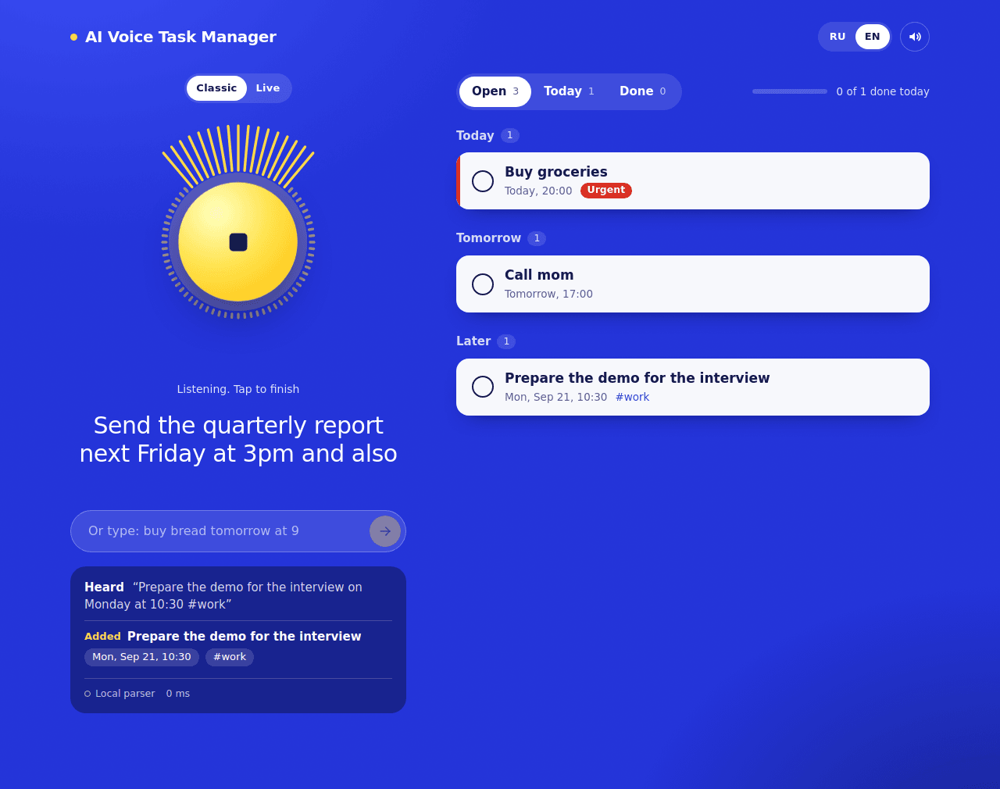
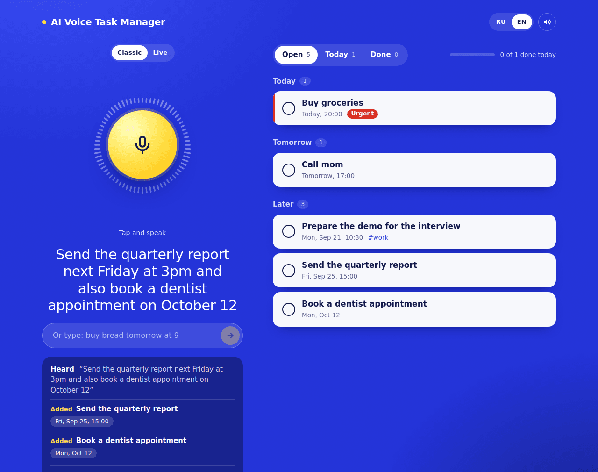
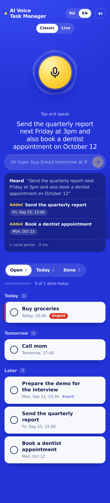
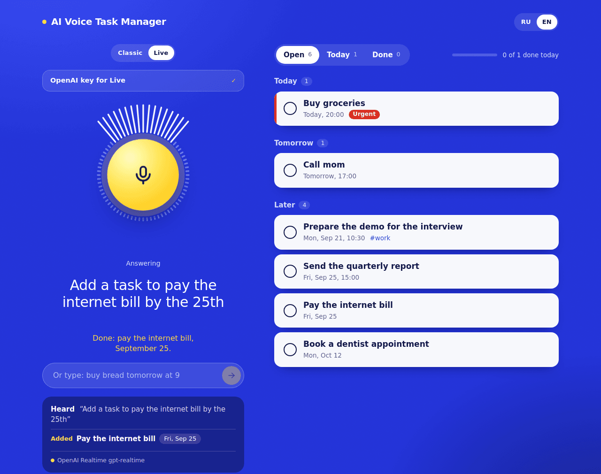

# AI Voice Task Manager

A task manager you talk to. Say *"remind me to call mom tomorrow at 5pm, urgent"* and it creates the task with the right date, time and priority, stored in a SQL database. Works in Russian and English.

<!-- Live demo: add your deployment URL here -->



## Contents

- [Why I built it](#why-i-built-it)
- [What it does](#what-it-does)
- [Two voice modes](#two-voice-modes)
- [How it works](#how-it-works)
- [Decisions worth explaining](#decisions-worth-explaining)
- [Tech stack](#tech-stack)
- [Getting started](#getting-started)
- [Configuration](#configuration)
- [Live mode: setup and troubleshooting](#live-mode-setup-and-troubleshooting)
- [API](#api)
- [Project structure](#project-structure)
- [Testing](#testing)
- [Deployment](#deployment)
- [Limitations and next steps](#limitations-and-next-steps)

## Why I built it

Most AI demos stop at a chat box. I wanted to build the parts around the model that decide whether a product feels solid: voice in and out, structured output that survives a bad answer, a real database, and a speech model that calls my own code.

One rule shaped a lot of the design: the app has to run after `git clone` with no API keys and no accounts. Anyone reviewing it should be able to try it within a minute, and the AI parts should make it better rather than make it possible.

## What it does

- **Speak or type.** One phrase can hold several tasks: *"send the report next Friday at 3pm and also book a dentist appointment on October 12"* becomes two tasks.
- **Understands dates, times, priorities and tags** in both languages: "tomorrow at 5pm", "in 2 hours", "next Friday", "15 October", "tonight", "urgent", "#work".
- **Edits by voice too.** "Mark buy milk as done" and "delete the presentation task" find the right task with fuzzy matching, including Russian word endings.
- **Shows its work.** After every command a panel lists what was understood, which engine understood it and how long it took.
- **Undo** for every change, including deletes.
- **Real persistence.** Tasks live in SQLite (or Turso in production). Every browser gets its own private list without signing up.
- **Works on a phone.** The layout is responsive; on desktop, Space toggles the microphone.

<p>
  
  
</p>

## Two voice modes

| | Classic | Live |
|---|---|---|
| Speech to text | Browser (Web Speech API) | OpenAI Realtime API |
| Understanding | Claude or OpenAI with a forced JSON schema; a built-in parser when no key is set | The model, calling my tools |
| Reply | Short text confirmation, optional browser voice | The model's own voice |
| Interaction | Tap, say one phrase | Start once, then just talk |
| Can answer questions | No | Yes ("what's on my list today?") |
| Needs | Nothing | An OpenAI key (paid) |

Both modes write to the same database, so you can switch between them freely.

<p>
  
</p>

## How it works

```
Classic
  mic ─▶ Web Speech API ─▶ text ─▶ POST /api/command ─▶ Claude / OpenAI (JSON schema)
                                          │                       │ any failure
                                          │                       ▼
                                          │              local RU/EN parser
                                          ▼
                              validated actions (zod)
                                          │
                                          ▼
                              applyActions() ─▶ diff ─▶ Drizzle ─▶ SQLite / Turso

Live
  browser ◀── WebRTC audio ──▶ OpenAI Realtime
     │                              │ function call (add_task, complete_task, ...)
     │                              ▼
     └──────────────▶ POST /api/realtime/tool ─▶ same service ─▶ same database
  (POST /api/realtime/session hands the browser a 2-minute key; the real key stays on the server)
```

A Classic command, step by step:

1. The browser sends the phrase with its own idea of "today" and "now".
2. The server loads the user's open tasks so the model can refer to them.
3. The engine returns a list of actions (`add`, `complete`, `delete`). Whatever it returns is validated and normalised.
4. The pure function `applyActions` computes the new task list.
5. The difference between old and new lists is written in one transaction.
6. The browser gets the fresh list plus a summary, and shows it.

## Decisions worth explaining

**The model's output is untrusted input.** Claude gets a forced tool call, OpenAI gets strict structured outputs, and either way the answer goes through a zod schema before it touches anything. Bad dates become `null`, empty titles are dropped, unknown task ids fall back to fuzzy matching by name. If the call times out, fails, or no key is configured, a rule-based parser produces the same action format. The user never sees an AI error for a simple sentence.

**Dates are strings, not timestamps.** A task due "tomorrow at 5pm" is `2026-09-19` plus `17:00`, in the user's wall-clock time. The browser sends its local date and time with each request and all date arithmetic runs on those strings in UTC. That makes results independent of the server's time zone and immune to daylight-saving surprises.

**One small storage interface.** All SQL lives in `db/repo.js` behind four methods. The business logic (`lib/server/tasksService.js`) only knows that interface, so it is unit-tested with an in-memory version, and the Drizzle version has its own integration test against a temporary SQLite file.

**Writes are diffs, and undo is a snapshot.** Every command computes what changed (inserts, updates, deletes) and applies it atomically. Undo sends the previous list back and the server diffs it the same way. One mechanism covers commands, toggles, deletes and undo. The restore endpoint validates every task and cannot overwrite another user's rows.

**Live mode keeps the API key on the server.** The server exchanges the real key for a two-minute ephemeral one, the browser talks to OpenAI directly with it, and every function call the model makes comes back to my API, where it is validated and executed against the database. The model never touches the database. Visitors can also paste their own key, which is used for one request and never stored, so a public deployment does not burn the owner's credit.

**Identity without accounts.** A random id in an HttpOnly cookie is enough to give each browser a private list. It is deliberately isolated in `lib/server/user.js`, so replacing it with real authentication touches one file.

**Parsing Russian with regular expressions.** `\b` and `\w` only understand ASCII, so a naive word-boundary regex silently fails on Cyrillic: "пятниц\w*" matched "пятниц" but not "пятницу". The parser uses Unicode property escapes and explicit lookarounds instead. I only noticed it because I ran the parser on real Russian phrases, which is a good argument for having tests for them.

**JavaScript, not TypeScript.** I chose plain ES modules and enforce the important contracts at runtime with zod, on the API boundary and on everything the model returns. TypeScript would be my next step for a longer-lived codebase.

**Plain CSS.** The interface is small and fairly custom, so one stylesheet with CSS variables was less work than fighting a framework.

## Tech stack

| Layer | Choice |
|---|---|
| Framework | Next.js 15 (App Router, route handlers), React 19 |
| Database | SQLite via libSQL, [Drizzle ORM](https://orm.drizzle.team); [Turso](https://turso.tech) in production |
| Voice | Web Speech API, Web Audio API, canvas, OpenAI Realtime API over WebRTC |
| LLMs | Claude (tool use) and OpenAI (structured outputs), both optional |
| Validation | Zod |
| State and motion | Zustand, Motion |
| Styling | Plain CSS |
| Tooling | Node test runner, Docker, GitHub Actions |

## Getting started

You need Node.js 20.9 or newer (22 recommended).

```bash
npm install
npm run dev
```

Open <http://localhost:3000>. That is everything: the SQLite file is created in `./data/`, and the built-in parser understands your phrases. Voice input needs Chrome, Edge or Safari on `localhost` or HTTPS; other browsers get the text field.

To use an LLM for understanding, or to enable Live mode, copy `.env.example` to `.env.local`, add a key and restart the dev server.

## Configuration

| Variable | Default | Purpose |
|---|---|---|
| `DATABASE_URL` | `file:./data/tasks.db` | SQLite file, or `libsql://...` for Turso |
| `DATABASE_AUTH_TOKEN` | | Turso token |
| `OPENAI_API_KEY` | | Enables Live mode; also usable for Classic understanding |
| `OPENAI_REALTIME_MODEL` | `gpt-realtime` | Preferred Realtime model. If OpenAI refuses it, `gpt-realtime` and `gpt-realtime-2` are tried |
| `OPENAI_REALTIME_VOICE` | `marin` | Voice of the assistant |
| `ANTHROPIC_API_KEY` | | Claude for Classic understanding |
| `ANTHROPIC_MODEL` | `claude-haiku-4-5-20251001` | Small and fast: latency matters for voice |
| `OPENAI_MODEL` | `gpt-4o-mini` | OpenAI model for Classic understanding |
| `AI_PROVIDER` | auto | Force `anthropic`, `openai` or `local` |
| `RATE_LIMIT_PER_MIN` | `30` | Per-IP limit on `/api/command` |

## Live mode: setup and troubleshooting

Live mode needs an OpenAI key with some credit on the account. Either put `OPENAI_API_KEY` in `.env.local` and restart the dev server, or paste a key into the Live panel in the app (it stays in your browser).

Run this to check that your key can open a Realtime session:

```bash
npm run check:live
```

It prints what is wrong if something is: rejected key, no credit, no access to Realtime models. The app also shows OpenAI's reason next to every Live error. Two more things to know: the microphone only works on `localhost` or HTTPS (not on `http://192.168.x.x`), and a session hangs up after two quiet minutes, because Realtime is billed per minute of audio.

## API

| Route | Purpose |
|---|---|
| `GET /api/tasks` | The current user's tasks |
| `POST /api/command` | Phrase to actions to database. Returns the new list, a summary, engine, model and latency |
| `PATCH /api/tasks/:id` | Mark done or not done |
| `DELETE /api/tasks/:id` | Delete a task |
| `POST /api/tasks/restore` | Undo: replace the list with a validated snapshot |
| `POST /api/tasks/clear-done` | Remove completed tasks |
| `POST /api/realtime/session` | Ephemeral key for a Live session (optional `X-OpenAI-Key` header) |
| `POST /api/realtime/tool` | Runs a function call from the Realtime model |
| `GET /api/capabilities` | What the server offers, without touching the database |
| `GET /api/health` | Database check, used by Docker |

Rate limits per IP: 30 commands, 6 Live sessions and 90 tool calls per minute.

## Project structure

```
app/                 Pages and route handlers (api/command, api/tasks, api/realtime, ...)
components/          App shell, voice orb with canvas spectrum, task board, insight panel, key panel
hooks/               Speech recognition, microphone analyser, speech synthesis, Realtime session
db/                  Drizzle schema, SQL bootstrap, libSQL client, the repository (all SQL lives here)
lib/nlu/             Zod schemas, LLM engines with fallback, the local RU/EN parser, fuzzy task matching
lib/realtime/        Session config and tools, event translator, ephemeral key exchange
lib/server/          Task service, cookie identity, route helpers, in-memory repo used by tests
lib/                 Pure helpers: dates, applyActions, i18n, formatting, API client, store
scripts/             check-realtime.mjs, the Live mode self-test
test/                Node test runner suites
```

## Testing

```bash
npm test
```

About seventy tests on the built-in Node test runner, no extra tooling:

- the RU/EN parser: dates, times, priorities, several tasks per phrase, complete and delete;
- both LLM engines with a mocked `fetch`, including every way a call can fail;
- the task service against an in-memory repo: isolation between users, undo, Realtime tools;
- the real route handlers end to end: cookies, validation, rate limits;
- the Realtime protocol layer: session config, event handling, key exchange and its error cases;
- the SQL schema, plus an integration test of the Drizzle repo against a temporary SQLite file.

What the tests do not cover: the WebRTC handshake with OpenAI, the browser microphone, and real LLM responses. `npm run check:live` covers the key and model access; the rest needs a manual run.

CI (`.github/workflows/ci.yml`) runs the tests and a production build on every push.

## Deployment

**Vercel with Turso (recommended)**

1. Create a database: `turso db create tasks`, then get its URL with `turso db show tasks --url` and a token with `turso db tokens create tasks`.
2. Push the repository to GitHub and import it on vercel.com. The Next.js preset needs no settings.
3. Add `DATABASE_URL` and `DATABASE_AUTH_TOKEN`. Optionally add `OPENAI_API_KEY` to enable Live for everyone, and `ANTHROPIC_API_KEY` for LLM understanding.

Without `DATABASE_URL`, Vercel falls back to a temporary file in `/tmp`. The app works but shows a warning, because tasks disappear when the instance restarts.

**Docker**

```bash
docker compose up --build
```

The SQLite file lives in the `task-data` volume, and `/api/health` is wired into the container health check.

## Limitations and next steps

Things I know are missing or simplified:

- **No real accounts.** The cookie identity is private per browser, but tasks do not follow you to another device.
- **No reminders.** Tasks have due dates and times, but the app does not notify you.
- **No recurring tasks.**
- **The local parser is rule-based.** It covers common phrasing in both languages, not free-form speech. With an LLM key it handles much more.
- **The rate limiter is in memory.** On serverless each instance counts separately.
- **Schema changes are not versioned yet.** Tables are created from SQL at startup; `drizzle-kit` is set up for when the schema needs to evolve.
- **Web Speech API support** is limited to Chromium browsers and Safari.

What I would do next: real authentication with migration of anonymous tasks, push notifications for due tasks, recurring tasks, a Playwright end-to-end suite in CI, and a TypeScript migration.

## Privacy

In Classic mode, Chrome sends microphone audio to Google for recognition and Safari uses Apple's service; in Live mode audio goes to OpenAI. The app does not record or store audio. It stores task text, and the text of each command in a log table, keyed to an anonymous id.
